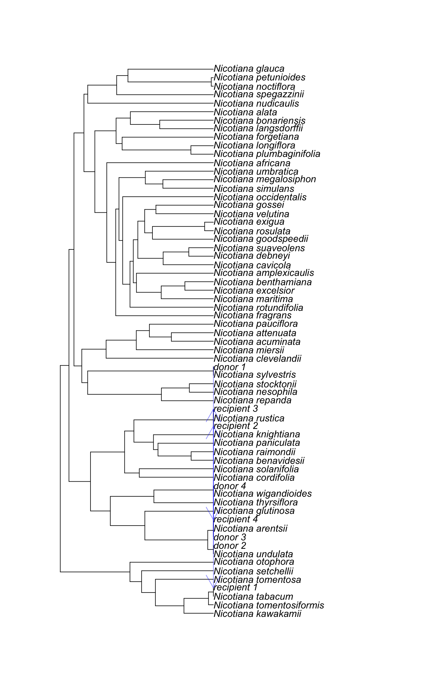

<!-- README.md is generated from README.Rmd. Please edit that file -->

# BMhyb

[](https://travis-ci.org/bomeara/BMhyb)
[](https://codecov.io/gh/bomeara/BMhyb)


Please see our help page at https://bomeara.github.io/BMhyb/.

While we often think of evolution as happening on a bifurcating
evolutionary tree, in reality gene flow between distinct lineages is
common. Until recently, there was little one could do about it. Our
BMhyb package allows for fitting models of evolution to phylogenetic
networks (also see [Bastide et
al. 2018](https://doi.org/10.1093/sysbio/syy033) for a similar
approach, which is implemented in the Julia package
[PhyloNetworks](https://github.com/crsl4/PhyloNetworks.jl)). We have
several models implemented that are restrictions of a general model. In
the most general case, we assume Brownian motion of a trait on a
phylogenetic network. Sometimes, lineages come together to form hybrids.
We typically assume the hybrids receive equal input from both parents,
but this can be altered. At the hybridization event, several things can
happen: there could be increased variation (due to transgressive
segregation, as in sunflowers) and/or there can be a shift in mean (as
in ligers and tigons).

## Installation

You can install BMhyb from github with:

``` r
# install.packages("devtools")
devtools::install_github("bomeara/BMhyb")
```

Input for the program is a phylogeny, trait data (currently just
univariate), and a data.frame containing flow information. This tells
the software where gene flow happened between lineages. This gene flow
can appear to go forward in time due to flow to unsampled lineages
before later hybridization, so one must specify both the time (height
from root) of the start of the divergence of the hybridization event and
the time at which the event completed (note, though, that it considers
it as a single event, not ongoing gene flow through all this time). Here
is a sample network for tobacco, after [Chase et
al. 2003](https://doi.org/10.1093/aob/mcg087).

<!-- -->

There are three hybridization events, leading from the blue lineages to
the red ones. This is described in the flow object (which you can see at
`nicotiana$flow`:

<table>

<thead>

<tr>

<th style="text-align:left;">

donor

</th>

<th style="text-align:left;">

recipient

</th>

<th style="text-align:right;">

gamma

</th>

<th style="text-align:right;">

time.from.root.donor

</th>

<th style="text-align:right;">

time.from.root.recipient

</th>

</tr>

</thead>

<tbody>

<tr>

<td style="text-align:left;">

Nicotiana\_sylvestris

</td>

<td style="text-align:left;">

Nicotiana\_tabacum

</td>

<td style="text-align:right;">

0.5

</td>

<td style="text-align:right;">

8.680207

</td>

<td style="text-align:right;">

8.680207

</td>

</tr>

<tr>

<td style="text-align:left;">

Nicotiana\_undulata

</td>

<td style="text-align:left;">

Nicotiana\_rustica

</td>

<td style="text-align:right;">

0.5

</td>

<td style="text-align:right;">

7.575319

</td>

<td style="text-align:right;">

7.575319

</td>

</tr>

<tr>

<td style="text-align:left;">

Nicotiana\_arentsii

</td>

<td style="text-align:left;">

Nicotiana\_rustica

</td>

<td style="text-align:right;">

0.5

</td>

<td style="text-align:right;">

7.575319

</td>

<td style="text-align:right;">

7.575319

</td>

</tr>

<tr>

<td style="text-align:left;">

Nicotiana\_wigandioides

</td>

<td style="text-align:left;">

Nicotiana\_arentsii

</td>

<td style="text-align:right;">

0.5

</td>

<td style="text-align:right;">

8.399526

</td>

<td style="text-align:right;">

8.399526

</td>

</tr>

</tbody>

</table>

There are three hybridization events, but four rows. This is because one
hybridization event goes from the lineage that is the ancestor of
*Nicotiana undulata* and *Nicotiana arentsii* to *Nicotiana rustica* and
this is specified appearing to be from both, but back in time back to
where they were the same lineage. Another way to see this is to use the
`LumpIntoClades()` function to create a new object:

``` r
kable(LumpIntoClades(phy=nicotiana$phy, flow=nicotiana$flow))
```

<table>

<thead>

<tr>

<th style="text-align:left;">

donor.clades

</th>

<th style="text-align:left;">

recipient.clades

</th>

<th style="text-align:right;">

gamma

</th>

<th style="text-align:right;">

time.from.root.donor

</th>

<th style="text-align:right;">

time.from.root.recipient

</th>

</tr>

</thead>

<tbody>

<tr>

<td style="text-align:left;">

Nicotiana\_sylvestris

</td>

<td style="text-align:left;">

Nicotiana\_tabacum

</td>

<td style="text-align:right;">

0.5

</td>

<td style="text-align:right;">

8.680207

</td>

<td style="text-align:right;">

8.680207

</td>

</tr>

<tr>

<td style="text-align:left;">

Nicotiana\_undulata,Nicotiana\_arentsii

</td>

<td style="text-align:left;">

Nicotiana\_rustica

</td>

<td style="text-align:right;">

0.5

</td>

<td style="text-align:right;">

7.575319

</td>

<td style="text-align:right;">

7.575319

</td>

</tr>

<tr>

<td style="text-align:left;">

Nicotiana\_wigandioides

</td>

<td style="text-align:left;">

Nicotiana\_arentsii

</td>

<td style="text-align:right;">

0.5

</td>

<td style="text-align:right;">

8.399526

</td>

<td style="text-align:right;">

8.399526

</td>

</tr>

</tbody>

</table>

`BMhyb` expects flow data.frames to be in the first format (one line per
species) but you can write it in the second format (note the different
column names) and convert it using the `UnlumpIntoTaxa()` function.

Only some hybrid networks can be analyzed using this framework.
Basically, each lineage must come from no more than one hybridization
event. We have tools to check this automatically (`?CheckFlow`). There
are ways to eliminate problems by deleting hybrid taxa or by deleting
hybridization events – `AdjustFlow` does this. Clearly, deleting taxa
eliminates data, which makes you lose precision; deleting events makes
you change history; neither is ideal. We are conservative with our
restrictions: for the networks we reject, we cannot guarantee that our
algorithm returns the correct variance covariance matrix. In such cases,
you may be interested in 1) building off our model, 2) trying
[PhyloNetworks](https://github.com/crsl4/PhyloNetworks.jl).

Besides the univariate trait data, another kind of data that can be
useful is what is commonly called “measurement error.” This could mean
actual measurement error: my ruler has markings every millimeter, so I
have trouble figuring out if this beetle is 10.2 or 10.3 mm long. But it
basically stands for all the variation that is present within a species.
Brownian motion and related models are basically fitting data to a
multivariate normal distribution. Covariances between species \[under
basic models\] come from evolution on the same branches; variation of a
tip value comes from both evolution along branches (Brownian motion
“wiggling”) and other sources of variation that don’t stem from that
evolutionary process: imprecision in the measurement, but also
intraspecific variation (the processes model the “average” value for a
species, but we know that intraspecific variation can be substantial and
important) and other sources of noise. Most comparative methods are done
assuming this uncertainty is zero: a single individual perfectly
represents the mean value for its species. This forces the model to deal
with any actual variation by forcing it to have happened on evolutionary
branches, increasing the inferred rate of evolution (and also making the
process look more like an Ornstein-Uhlenbeck one, assuming the true
process is Brownian motion). By default, `BMhyb` instead tries to
estimate this measurement error, though this is hard to do well. Better
is inputing actual uncertainty from estimates in the data: this could be
done by measuring multiple individuals in some or all species or even
approaches as crude as saying that one expects 10% uncertainty on each
trait value.

Once you have your data, tree, and flow, you can run analyses. By
default, `BMhyb` tries models variation at hybridization events (vh)
fixed at zero or free to vary, and expected ratio of increase or
decrease in trait value at hybridization fixed at one or allowed to
vary. There are two optimization strategies. `BMhyb()` uses a grid to
get starting values, then uses R’s built in optimizer to attempt to hill
climb. It has various checks to avoid getting stuck. `BMhybGrid()` just
tries many values in parameter space, avoiding some of the issues with
optimization.

One common issue experienced in optimizing are problems with matrix
condition – basically, internally the algorithm tries to invert a
matrix, but for some combinations of networks and parameter values,
numerically the matrix cannot be inverted (see
[Wikipedia](https://en.wikipedia.org/wiki/Condition_number) if you’re
curious about the details. Note we accept pull requests to improve the
code). There are approaches to dealing with this, but they often work by
increasing the values on the diagonals of the variance covariance matrix
– which biologically means artificially creating more “measurement
error” in the model. We have various approaches to adjusting poorly
conditioned matrices in `BMhyb`: most are turned off by default, and the
one we do use we add a penalty to likelihood results that do use this.
Make sure to look at your likelihoods to see if they seem reasonable,
and in general poke around to make sure you believe the results the
program gives you (this is good advice in general).

Uncertainty is often substantial. Akaike weights are an estimate in the
uncertainty in which model is best under the Akaike Information
Criterion and are given by default. Parameter estimates are also
uncertain. Fast ways to estimate the uncertainty involve looking at the
curvature of the likelihood surface. Other approaches vary a single
parameter at a time while holding the others at their maximum likelihood
estimates and measuring the response. This can miss ridges: areas where
one can vary one parameter at a time and quickly decline in value, but
where one could vary both with little effect (for example, imagine
looking at the plot of `x+y-10` and seeing where this was close to zero:
if `y=5`, then x has to stay near 5 if we do not want the total to be
far from 0, but if we allow both to vary, we can have an infinite array
of values). To detect this, we vary all the points in an adaptive way to
feel our way around an island of good likelihood to get estimates. Plots
of this show points within a certain region (following Edwards, a ∆lnL
of 2 is taken as the region) and points sampled outside.
